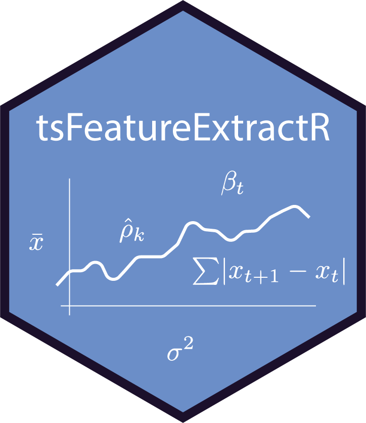

# tsFeatureExtracR

[](https://CRAN.R-project.org/package=tsFeatureExtracR)
[](https://opensource.org/licenses/MIT)
[](https://zenodo.org/badge/latestdoi/675141094)


<p float="left">
  
  `tsFeatureExtracR` is a package for R that provides a set of functions for feature extraction from time series data. The focus is on meaningful time series features for psychological (ESM) data. Several of the calculations are based on the amazing work of the team working on the [tsfresh python package](https://tsfresh.readthedocs.io/en/latest/). The package additionally offers simple tools for analyzing and dealing with missing data in extracted time series features. These functionalities are aimed at understanding meaningful features of psychological time series and accompany a research paper on feature-based time series clustering in ESM research.
</p> 

<table>
<tr>
<td>
  
<!-- Image on the left side -->


</td>
<td>

<!-- Text description on the right -->
`tsFeatureExtracR` is a package for R that provides a set of functions for feature extraction from time series data. The focus is on meaningful time series features for psychological (ESM) data. Several of the calculations are based on the amazing work of the team working on the [tsfresh python package](https://tsfresh.readthedocs.io/en/latest/). The package additionally offers simple tools for analyzing and dealing with missing data in extracted time series features. These functionalities are aimed at understanding meaningful features of psychological time series and accompany a research paper on feature-based time series clustering in ESM research.
</td>
</tr>
</table>

## Installation

You can install the development version from [GitHub](https://github.com/JannisCodes/tsFeatureExtracR) with:

```r
# install.packages("devtools")
devtools::install_github("JannisCodes/tsFeatureExtracR")
```

## Usage

```r
library(tsFeatureExtracR)
```

Then use the functions provided by the package to extract features, analyse missingness, and impute missing values.

## Dependencies

`tsFeatureExtracR` depends on R (>= 4.1.0) and uses the following packages:

- dplyr
- mice
- ggplot2
- ggthemes
- grid
- scales
- tibble
- nlme
- psych
- MASS
- mgcv
- stats

## Contributing

Contributions are welcome! For bug reports or suggestions, please open an issue.

## License

MIT © Jannis Kreienkamp

## Contact

For any other questions, feel free to reach out to Jannis Kreienkamp at jannis@data-delight.com.
